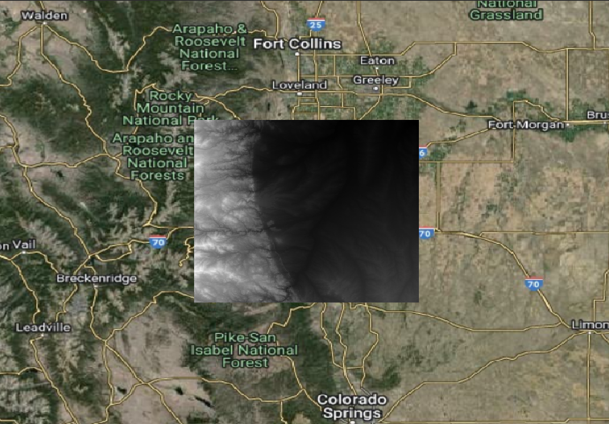
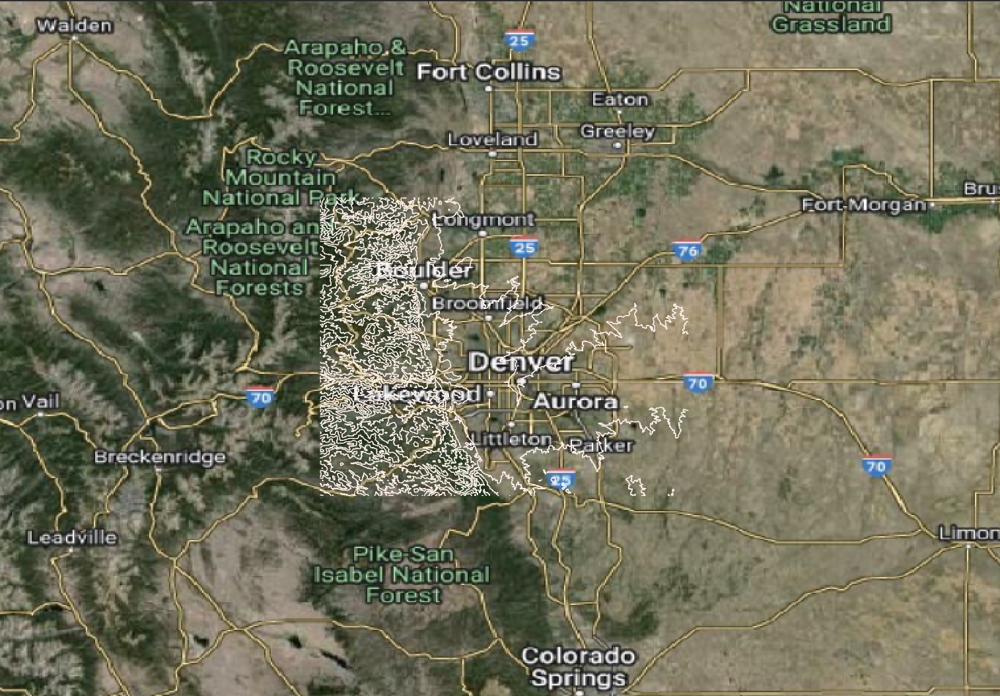

# Working with Raster Data in PostGIS

Disclaimer: This guide is based on the [Spatial SQL](https://spatial-sql.com) book by Matthew Forrest.


In this exercise, we'll guide you through the process of working with raster data in PostGIS. This involves using various tools and interfaces to ingest, analyze, and visualize raster data. Here's an explicit delineation of the relationships between the technologies we'll use and the steps involved, flagged by the command line interface or application where each step is performed:


## Introduction to the Technologies
- PostgreSQL/PostGIS: An open-source relational database system enhanced with PostGIS, an extension for spatial data support. PostGIS allows for storing and querying data with geographic properties.
- Docker: A platform for developing, shipping, and running applications in containers. Containers allow you to package your application, including its dependencies, into a standardized unit for software development.
- pgAdmin: A web-based administration tool for PostgreSQL. It provides a graphical interface to manage databases, run queries, and manage database objects.
- QGIS: An open-source geographic information system application that allows you to create, edit, analyze, and visualize geospatial information on Windows, Mac, Linux, and BSD.
- Remote Server: In this context, it refers to a computer that hosts your PostGIS database. It can be accessed over a network via tools like pgAdmin or command-line interfaces.
- Your Local Machine: The computer you're using to perform this exercise. It interacts with Docker to run PostGIS in a container and uses pgAdmin and QGIS for database management and geospatial analysis, respectively.


Spatial analytics often relies on both vector and raster data types. While PostGIS has been traditionally used for vector data, its capabilities now extend to handling raster data efficiently, thanks to extensions added in versions following PostGIS 1.5. This guide walks you through the process of ingesting, analyzing, and transforming raster data using PostGIS and various tools including Docker, pgAdmin, and QGIS.


## Basic Raster Analysis

### 1. Set Up PostGIS in Docker:
- **Interface**: Terminal on your local machine.
- **Command**: Use docker pull to download the PostGIS Docker image and `docker run` to start a PostGIS container. This step encapsulates both PostgreSQL and PostGIS in a containerized environment, simplifying the setup process.

    a. **Pull the PostGIS Docker Image:**
   ```bash
   docker pull postgis/postgis:15-master
    ```

    b. **Run the Docker Container:**
    ```bash
    docker run --name mini-postgis -p 35432:5432 --network="host" \
    -v /your/data/directory:/mnt/mydata \
    -e POSTGRES_USER=admin -e POSTGRES_PASSWORD=password -d postgis/postgis:15-master
    ```

    This command creates a container named `mini-postgis` with the PostGIS image, mapping port 35432 to the container's port 5432, and setting the Postgres user and password to `admin` and `password`, respectively. The `-v` flag mounts the host directory `/your/data/directory` to the container's `/mnt/mydata` directory. The `--network="host"` flag allows the container to use the host's network settings. *Here, we will use "mini-postgis" docker container and "postgis" as the local database.*


### 2. Access PostGIS Container for Raster Data Ingestion:
- **Interface**: Terminal on your local machine.
- **Container**: mini-postgis.
- **Command**: Use `docker exec -it mini-postgis bash` to access the PostGIS container's command line. This step is necessary for running the `raster2pgsql` command to ingest raster data into PostGIS.
- The access command may not be necessary if you haven't closed the terminal after running the Docker container. In that case, you can proceed to the next step without accessing the container again.


### 3. Ingest Raster Data into PostGIS:
- **Interface**: Terminal within the mini-postgis Docker container.
- **Command**: Run `raster2pgsql` followed by `psql` to ingest raster data. This process converts raster data into a format that can be stored in PostGIS and then inserts it into the database.

     ```bash
    raster2pgsql -s 4326 -I -C -M /mnt/mydata/raster.tif -F -t 100x100 | psql -d postgis -h 127.0.0.1 -p 25432 -U docker -W
    ```
    This command ingests the raster data from `/mnt/mydata/raster.tif` into the database `postgis`. The `-s` flag specifies the spatial reference system (SRS) of the raster data, `-I` creates a spatial index, `-C` cleans up the data after ingestion, and `-M` uses the `raster` column type. The `-F` flag forces the data to be ingested, and `-t` specifies the tile size. The tile size should be adjusted based on the raster data's resolution and size. The `-d` flag specifies the database name, `-h` specifies the host, `-p` specifies the port, and `-U` specifies the user. The `-W` flag tells the command to skip the password prompt.

### 4. Enable the `postgis_raster` Extension:
- **Interface**: pgAdmin.
- Action: Connect to your main database and run `CREATE EXTENSION postgis_raster;` to enable the `postgis_raster` extension. This extension provides functions for working with raster data in PostGIS.

    ```sql
    CREATE EXTENSION postgis_raster;
    ```
    This command enables the `postgis_raster` extension in your database, allowing you to work with raster data.

### 5. Generate Contour Lines from Raster Data:
- **Interface**: pgAdmin.
- Action: Use the `ST_Contour` function to generate contour lines from raster data. This function creates contour lines at specified intervals based on the raster data.

    ```sql
    with c as (
        select
        (st_contour(rast, 1, 200.00)).*
        from
        raster_table
        where
        filename = 'raster.tif'
    )
    select
        st_transform(geom, 4326),
        id,
        value
    from
        c
    ```
    This query generates contour lines from the raster data in the `raster_table` table, where the filename is `raster.tif`. The `ST_Contour` function creates contour lines at intervals of 200.

### 6. Visualize Contour Lines in QGIS:
- **Interface**: QGIS.
- 


### Raster Ingest

To ingest raster data into a PostGIS database, we'll start by using the `raster2pgsql` tool. This process involves creating a *Docker* image specifically for raster data ingestion, as running the ingestion commands in the same environment as your main database isn't considered best practice.

1. **Pull the PostGIS Docker Image:**

   ```bash
   docker pull postgis/postgis:15-master
    ```
    Alternatively, you can use the Docker Desktop app to search for the postgis/postgis image and pull the 15-master tag.

2. **Run the Docker Container:**

    After pulling the image, run it using the following command, adjusting the volume path to match your system:
    
    ```bash
    docker run --name mini-postgis -p 35432:5432 --network="host" \
    -v /your/data/directory:/mnt/mydata \
    -e POSTGRES_USER=admin -e POSTGRES_PASSWORD=password -d postgis/postgis:15-master
    ```
    This command creates a container named `mini-postgis` with the PostGIS image, mapping port 35432 to the container's port 5432, and setting the Postgres user and password to `admin` and `password`, respectively. The `-v` flag mounts the host directory `/your/data/directory` to the container's `/mnt/mydata` directory.

3. **Enable the `postgis_raster` Extension:**

    Using `pgAdmin`, connect to your main database and run:

    ```sql
    CREATE EXTENSION postgis_raster;
    ```

    This command enables the `postgis_raster` extension in your database, allowing you to work with raster data.

4. **Ingest Raster Data:**
    
    To ingest raster data into your database, run the following command in the Docker container, mini-postgis.
    
    If you have not closed the terminal, you can run the following command in the same terminal; otherwise, open a new terminal and access the container using `docker exec -it mini-postgis bash`. Then run the following command:

    ```bash
    raster2pgsql -s 4326 -I -C -M /mnt/mydata/raster.tif -F -t 100x100 | psql -h 127.0.0.1 -p 25432 -U admin -d your_database
    ```
    This command ingests the raster data from `/mnt/mydata/raster.tif` into the database `your_database`. The `-s` flag specifies the spatial reference system (SRS) of the raster data, `-I` creates a spatial index, `-C` cleans up the data after ingestion, and `-M` uses the `raster` column type. The `-F` flag forces the data to be ingested, and `-t` specifies the tile size. The tile size should be adjusted based on the raster data's resolution and size.

    **Important Note**: The port 25432 is used for the database connection within this command, which should match the port number where your primary PostGIS database is accessible. This is distinct from the 35432 port used by the mini-postgis Docker container itself. Make sure to use the correct port numbers based on how your Docker containers and databases are configured.

5. Analyze the Raster Data:
  - **Interface**: pgAdmin.
  - **Action**: 
    After ingesting the raster data, you can analyze it using PostGIS functions. For example, you can generate contour lines from the raster data using the `ST_Contour` function.
    
        ```sql
        with c as (
            select
            (st_contour(rast, 1, 200.00)).*
            from
            raster_table
            where
            filename = 'raster.tif'
        )
        select
            st_transform(geom, 4326),
            id,
            value
        from
            c
        ```

    This query generates contour lines from the raster data in the `raster_table` table, where the filename is `raster.tif`. The `ST_Contour` function creates contour lines at intervals of 200.
6. **Visualize the Contour Lines:**
  - **Interface**: QGIS.
  - **Action**: 
    To visualize the contour lines in QGIS, connect to your PostGIS database and add the `contours` table as a layer. You can adjust the symbology and labeling to better visualize the contour lines.

    
    
    


## Interpolation

PostGIS provides functions for interpolating raster data, such as `ST_Reclass` and `ST_MapAlgebraExpr`. These functions can be used to perform various raster operations, such as reclassification and map algebra.


### Perform Spatial Interpolation:
- **Interface**: pgAdmin
- **Action**: Import weather station data into PostGIS using ogr2ogr via pgAdmin. Run SQL scripts to perform IDW spatial interpolation on the imported weather data, creating a new interpolated raster within PostGIS.
- **Command**:
    ```sql
    -- Import weather station data into PostGIS
    CREATE TABLE weather_stations AS
    SELECT ST_SetSRID(ST_MakePoint(lon, lat), 4326) AS geom, temperature
    FROM weather_stations_csv;

    -- Perform IDW spatial interpolation
    CREATE TABLE interpolated_raster AS
    SELECT ST_MapAlgebraExpr(
        ST_AddBand(ST_MakeEmptyRaster(0.1, 0.1, 0, 0, 0.1), '32BF'::text, 1, 0),
        '32BF',
        'ST_InvDistWeighting(rast, temperature, 12, 1, 0.5, 0.1, 0.1, 0.1, 0.1, 12, 0, false)',
        '32BF',
        'LAST'
    ) AS rast
    FROM weather_stations;
    ```

This script imports weather station data from a CSV file into a PostGIS table named `weather_stations`. It then performs Inverse Distance Weighting (IDW) spatial interpolation on the temperature values from the weather stations, creating an interpolated raster in the `interpolated_raster` table.


